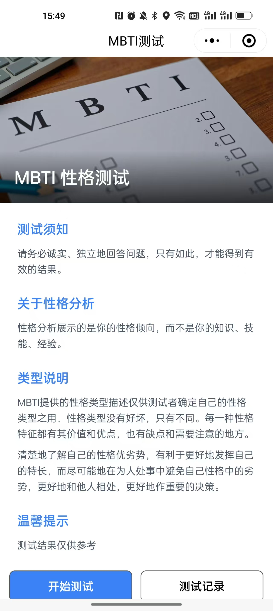
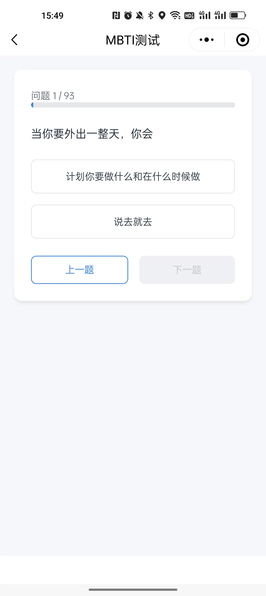
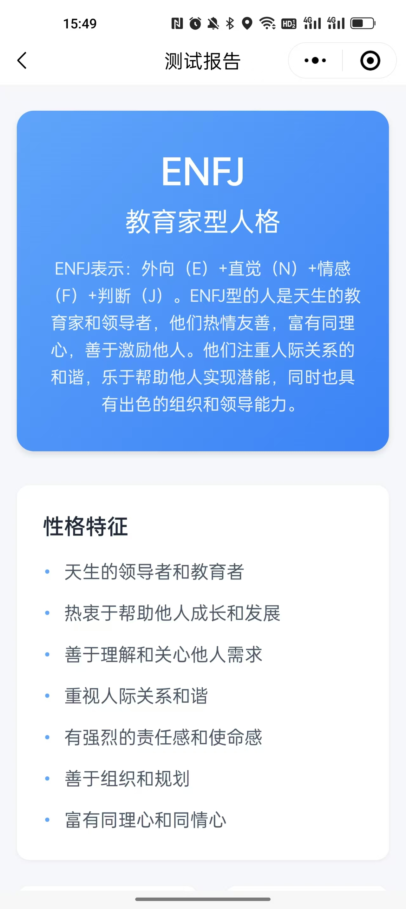
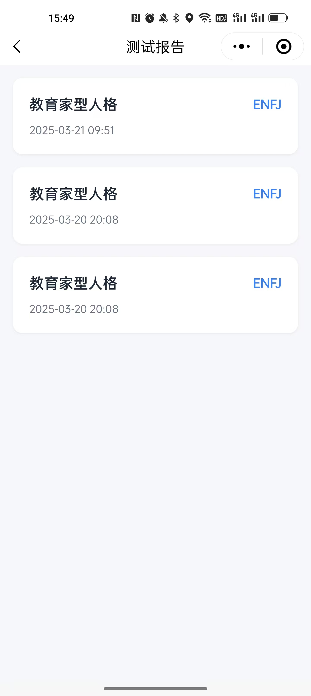

# MBTI职业性格测试小程序

一款基于Taro搭建的MBTI职业性格测试微信小程序

## 页面展示

<div style="display: flex; flex-wrap: wrap; gap: 10px; justify-content: center">
  
  
  
  
</div>

## 使用

1. clone本项目

2. 安装依赖

```shell
pnpm install
```
3. 启动项目

```shell
pnpm dev:weapp
```

4. 下载微信开发者工具，导入此项目